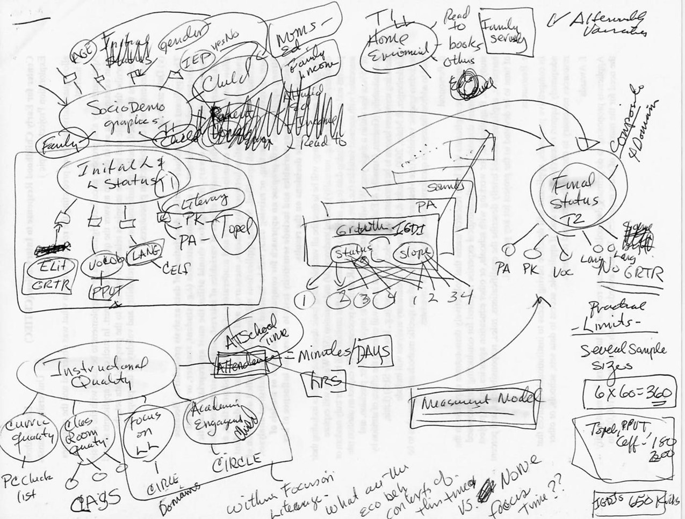

exclude: true

```{r child = "_setup.Rmd"}
```


---

## Navigating Research Complexities

```{r, out.width = "65%", echo = F}

```

---

```{r eci, echo=FALSE, eval = F}
library(ggplot2)
library(gridExtra)
library(tidyverse)
library(gganimate)
library(directlabels)
library(png)
library(transformr)
library(grid)
library(magick)

eci <- read.csv(file = "images/eci_long.csv")
eci$Type <- factor(eci$Type, levels = c("Gestures", "Vocalizations", "Single Words", "Multiple Words"))

theme_Publication <- function(base_size=24, base_family="sans") {
  library(grid)
  library(ggthemes)
  (theme_foundation(base_size=base_size, base_family=base_family)
    + theme(plot.title = element_text(face = "bold",
                                      size = rel(1.2), hjust = 0.5),
            text = element_text(),
            panel.background = element_rect(colour = NA),
            plot.background = element_rect(colour = NA),
            panel.border = element_rect(colour = NA),
            axis.title = element_text(face = "bold",size = rel(1)),
            axis.title.y = element_text(angle=90,vjust =2),
            axis.title.x = element_text(vjust = -0.2),
            axis.text = element_text(), 
            axis.line = element_line(colour="black"),
            axis.ticks = element_line(),
            panel.grid.major = element_line(colour="#f0f0f0"),
            panel.grid.minor = element_blank(),
            legend.key = element_rect(colour = NA),
            legend.position = "none",
            legend.direction = "horizontal",
            legend.key.size= unit(0.2, "cm"),
            legend.margin = unit(0, "cm"),
            legend.title = element_text(face="italic"),
            plot.margin=unit(c(10,30,5,5),"mm"),
            strip.background=element_rect(colour="#f0f0f0",fill="#f0f0f0"),
            strip.text = element_text(face="bold")
    ))
  
}

p <-  
  ggplot(data = eci, aes(x= time, y=Rate, group=Type, colour=Type)) +
  geom_line(size=3.5, show.legend = FALSE) +
  ylab("Rate per Minute") + xlab("Time (in months)") + 
  scale_x_continuous(breaks = round(seq(min(eci$time), 54, by = 6), 1)) + 
  scale_y_continuous(breaks = round(seq(0, 6, by = 1), 2)) +
  theme_Publication() +
  geom_dl(aes(label=Type), method = list("last.points", cex = 2)) + 
  labs(title = 'ECI key skills at {frame_along} months') +
  coord_cartesian(clip = 'off') + 
  transition_reveal(time) +
  ease_aes('quadratic-in-out')

# Run animation  
animate(p, nframes=60, fps=5, width = 1200, height = 720, end_pause = 10, renderer = magick_renderer())

# Save animation
#anim_save("C:/Users/waylon/Desktop/csp-2021/images/eci.gif", animation = last_animation())

```

```{r, out.width = "100%", echo = F}

```

---

#  About me

[Waylon Howard](https://wwwaylon.github.io/)

- Principal Quantitative Methodologist and Biostatistician at [*Biostatistics, Epidemiology and Analytics in Research (BEAR) Core*](https://www.seattlechildrens.org/research/resources/bear) (Seattle Children's Research Institute) 

--
  - Research methods, statistics, and measurement
  - Grant writing, manuscript development, and methodological innovation
  - Training and mentoring

---

# About you

- What's your name?  
- What is your research area?  
- What are your experiences with latent variable modeling in research (and the tools used)?
- What are your expectations for this workshop?

---

# Preliminaries

Slides and material are available at

.center[
https://github.com/wwwaylon/bcorp-2025
]

- The session consists of a combination of lectures and hands-on exercises
- Feel free to ask questions anytime
- We will primarily rely on [`GitHub`](https://github.com/), [`R`](https://www.r-project.org/) & [*RStudio*](https://www.rstudio.com/products/rstudio/) with additional support for [`SAS`](https://www.sas.com/en_us/home.html) and even [`Excel`](https://www.microsoft.com/en-us/microsoft-365/excel). 

---

## Workshop schedule

.center[**Wednesday, November 20th, 2024**]

```{r schedule Wed, echo = F}
schedule <- data.frame(
  "When?" = c("12:00 - 12:10", "12:10 - 12:25", "12:25 - 12:45", "12:45 - 1:00")
  , "&nbsp;" = "&nbsp;"
  , "What?" = c("Introduction", "Estimation and Model Fit", "Applied Examples", "<i>Questions</i>")
  , check.names = FALSE
)
knitr::kable(
  schedule
  , format = "html"
  , align = "ll"
  , escape = FALSE
)
```

---

## Survey Measurement

***
<span style="font-size: 70%;">
1. My friends really try to help me.
1. I can count on my friends when things go wrong.
1. I can talk about my problems with my friends.
</span>
***

<br>

```{r, echo=FALSE}

# Create a data frame
data <- data.frame(
VeryStronglyDisagree = c("1"),
StronglyDisagree = c("2"),
MildlyDisagree = c("3"), 
Neutral = c("4"), 
MildlyAgree = c("5"), 
StronglyAgree = c("6"),
VeryStronglyAgree = c("7")
)

colnames(data) <- c("Very Strongly Disagree", "Strongly Disagree", "Mildly Disagree", "Neutral", "Mildly Agree", "Strongly Agree", "Very Strongly Agree")

t1 <- kable(data, format = "html", align = "c") %>%
  kable_styling(position = "center", font_size = 18)

```

`r t1`

<center><small> Higher scores = More Perceived Social Support </small></center>

---

class: middle, left

1. My friends really try to help me.
***


.pull-left[
<span style="color:#3F4A13;"> $X_i$ </span> = <span style="color:#052147;"> $T_i$ </span> + (<span style="color:#BD8C00;"> $S_i$ </span> + <span style="color:black;"> $e_i$ </span>)<br>
<span style="font-size: 95%;"><span style="color:#052147;"> $T_i$ </span> is the 'true' score</span><br>
<span style="font-size: 95%;"><span style="color:#BD8C00;"> $S_i$ </span> is item-specific, yet reliable</span><br>
<span style="font-size: 95%;"><span style="color:black;"> $e_i$ </span> is random error, or noise</span>
]

.pull-right[
<span style="font-size: 90%;">.highlight[Using the scoring procedure]: 
<br>
`r emo::ji("see_no_evil")` No measurement error<br> 
`r emo::ji("hear_no_evil")` Uniform items<br> 
`r emo::ji("speak_no_evil")` Invariance
</span>
]

---

class: middle, center

## Path Diagram


---

class: middle, center

<span style="color:#3F4A13; font-size: 125%;"> $X_i$ </span> = <span style="color:#052147; font-size: 125%;"> $T_i$ </span> + (<span style="color:#BD8C00; font-size: 125%;"> $S_i$ </span> + <span style="color:black; font-size: 125%;"> $e_i$ </span>)


<small><small>Illustration adapted from [Little, T. D. (2024)](https://www.guilford.com/books/Longitudinal-Structural-Equation-Modeling/Todd-Little/9781462553143).</small></small>

---

```{r, echo=FALSE}

# Create the data frame with the provided data
data <- data.frame(
  X1 = c(5.66, 4.90, 4.33),
  X2 = c(NA, 5.50, 4.38),
  X3 = c(NA, NA, 5.63)
)

# Assign row names to the data frame
rownames(data) <- c("X1", "X2", "X3")
colnames(data) <- c("X1", "X2", "X3")

# Round all numeric columns to 3 decimal places and replace NA with empty string
data[1:3] <- lapply(data[1:3], function(x) ifelse(is.na(x), "", format(round(x, 2), nsmall = 2)))

t01 <- kable(data, format = "html", align = "c", 
             col.names = c("X1", "X2", "X3")) %>%
  kable_styling(position = "center", font_size = 14, full_width = T, bootstrap_options = c("striped", "hover")) %>%
  row_spec(0, bold = TRUE) %>%
  column_spec(1, width = "40px", bold = TRUE, border_right = TRUE) %>%
  column_spec(2, width = "125px", border_right = TRUE) %>%
  column_spec(3, width = "125px", border_right = TRUE) %>%
  column_spec(4, width = "125px")


# Create the data frame with the provided data using HTML entities for Greek letters
data <- data.frame(
  X1 = c("&lambda;<sub>11</sub> &lambda;<sub>11</sub> + &theta;<sub>11</sub>", "&lambda;<sub>11</sub> &lambda;<sub>21</sub>", "&lambda;<sub>11</sub> &lambda;<sub>31</sub>"),
  X2 = c("", "&lambda;<sub>21</sub> &lambda;<sub>21</sub> + &theta;<sub>22</sub>", "&lambda;<sub>21</sub> &lambda;<sub>31</sub>"),
  X3 = c("", "", "&lambda;<sub>31</sub> &lambda;<sub>31</sub> + &theta;<sub>33</sub>")
)

# Assign row names to the data frame
rownames(data) <- c("X1", "X2", "X3")

# Create the kable table with specified column widths
t02 <- kable(data, format = "html", align = "c", 
             col.names = c("X1", "X2", "X3"), escape = FALSE) %>%
  kable_styling(position = "center", font_size = 14, full_width = T, bootstrap_options = c("striped", "hover")) %>%
  row_spec(0, bold = TRUE) %>%
  column_spec(1, width = "40px", bold = TRUE, border_right = TRUE) %>%
  column_spec(2, width = "125px", border_right = TRUE) %>%
  column_spec(3, width = "125px", border_right = TRUE) %>%
  column_spec(4, width = "125px")
  
# Create the data frame with the provided data using HTML entities for Greek letters
data <- data.frame(
  X1 = c("&psi;<sub>11</sub> + &theta;<sub>11</sub>", "&psi;<sub>11</sub> &lambda;<sub>21</sub>", "&psi;<sub>11</sub> &lambda;<sub>31</sub>"),
  X2 = c("", "&lambda;<sub>21</sub> &psi;<sub>11</sub> &lambda;<sub>21</sub> + &theta;<sub>22</sub>", "&lambda;<sub>21</sub> &psi;<sub>11</sub> &lambda;<sub>31</sub>"),
  X3 = c("", "", "&lambda;<sub>31</sub> &psi;<sub>11</sub> &lambda;<sub>31</sub> + &theta;<sub>33</sub>")
)

# Assign row names to the data frame
rownames(data) <- c("X1", "X2", "X3")

# Create the kable table with specified column widths
t03 <- kable(data, format = "html", align = "c", 
             col.names = c("X1", "X2", "X3"), escape = FALSE) %>%
  kable_styling(position = "center", font_size = 14, full_width = T, bootstrap_options = c("striped", "hover")) %>%
  row_spec(0, bold = TRUE) %>%
  column_spec(1, width = "40px", bold = TRUE, border_right = TRUE) %>%
  column_spec(2, width = "150px", border_right = TRUE) %>%
  column_spec(3, width = "150px", border_right = TRUE) %>%
  column_spec(4, width = "150px")


# Create the data frame with the provided data using HTML entities for Greek letters
data <- data.frame(
  X1 = c("(3-&lambda;<sub>21</sub>-&lambda;<sub>31</sub>) &psi;<sub>11</sub> (3-&lambda;<sub>21</sub>-&lambda;<sub>31</sub>) + &theta;<sub>11</sub>", "(3-&lambda;<sub>21</sub>-&lambda;<sub>31</sub>) &psi;<sub>11</sub> &lambda;<sub>21</sub>", "(3-&lambda;<sub>21</sub>-&lambda;<sub>31</sub>)&psi;<sub>11</sub> &lambda;<sub>31</sub>"),
  X2 = c("", "&lambda;<sub>21</sub> &psi;<sub>11</sub> &lambda;<sub>21</sub> + &theta;<sub>22</sub>", "&lambda;<sub>21</sub> &psi;<sub>11</sub> &lambda;<sub>31</sub>"),
  X3 = c("", "", "&lambda;<sub>31</sub> &psi;<sub>11</sub> &lambda;<sub>31</sub> + &theta;<sub>33</sub>")
)

# Assign row names to the data frame
rownames(data) <- c("X1", "X2", "X3")

# Create the kable table with specified column widths
t04 <- kable(data, format = "html", align = "c", 
             col.names = c("X1", "X2", "X3"), escape = FALSE) %>%
  kable_styling(position = "center", font_size = 14, full_width = T, bootstrap_options = c("striped", "hover")) %>%
  row_spec(0, bold = TRUE) %>%
  column_spec(1, width = "40px", bold = TRUE, border_right = TRUE) %>%
  column_spec(2, width = "125px", border_right = TRUE) %>%
  column_spec(3, width = "125px", border_right = TRUE) %>%
  column_spec(4, width = "125px")


#--- Full Martix Formula

# Create the data frame with the provided data using HTML entities for Greek letters
sigma <- data.frame(
  X1 = c("&lambda;<sub>11</sub> &psi;<sub>11</sub> &lambda;<sub>11</sub> + &theta;<sub>11</sub>", "&lambda;<sub>11</sub> &psi;<sub>11</sub> &lambda;<sub>21</sub>", "&lambda;<sub>11</sub> &psi;<sub>11</sub> &lambda;<sub>31</sub>"),
  X2 = c("", "&lambda;<sub>21</sub> &psi;<sub>11</sub> &lambda;<sub>21</sub> + &theta;<sub>22</sub>", "&lambda;<sub>21</sub> &psi;<sub>11</sub> &lambda;<sub>31</sub>"),
  X3 = c("", "", "&lambda;<sub>31</sub> &psi;<sub>11</sub> &lambda;<sub>31</sub> + &theta;<sub>33</sub>")
  )

# Assign row names to the data frame
rownames(sigma) <- c("X1", "X2", "X3")

# Create the kable table with specified column widths
t10 <- kable(sigma, format = "html", align = "c", 
             col.names = c("X1", "X2", "X3"), escape = FALSE) %>%
  kable_styling(position = "center", font_size = 14, full_width = T, bootstrap_options = c("striped", "hover")) %>%
  row_spec(0, bold = TRUE) %>%
  column_spec(1, width = "40px", bold = TRUE, border_right = TRUE) %>%
  column_spec(2, width = "125px", border_right = TRUE) %>%
  column_spec(3, width = "125px", border_right = TRUE) %>%
  column_spec(4, width = "125px")

```


class: middle, center

.pull-left-40[
<br>
<span style="font-size: 75%;">
Estimated Parameters: **7**<br>
Observed Information: **6**
</span>

<span style="font-size: 80%;"> .highlight[Model Identification]:<br> 
`r emo::ji("astonished")` $a + b = 20$<br> 
`r emo::ji("smile")` $a + 10 = 20$</span>

]

.pull-right-60[
<span style="font-size: 80%;">
**Matrix Formula:** <span style="color:#187EA1;"> $\Sigma = \Lambda \Psi \Lambda'+ \Theta$ </span> 

<span style="font-size: 80%; color:#187EA1;"> $\Sigma$ </span> <span style="font-size: 80%;"> = **Variance/Covariance Matrix**</span> 
`r t01`

<span style="font-size: 80%;"> **Model Implied Matrix** </span> 
`r t10`
]

---

class: middle, center

## Set the scale (via latent variance)

.pull-left-60[

<span style="font-size: 60%;">
Observed Variance/Covariance Matrix<br>
</span>

`r t01`

<span style="font-size: 70%;">
.highlight[Just Identified.]<br>
</span>

`r t02`

]

.pull-right-40[

<span style="font-size: 60%;">Fix the latent variance to 1.0</span>


 
]

---

class: middle, center

## Set the scale (via indicator)

.pull-left-60[

<span style="font-size: 60%;">
Observed Variance/Covariance Matrix<br>
</span>

`r t01`

<span style="font-size: 70%;">
.highlight[Just Identified.]<br>
</span>

`r t03`

]

.pull-right-40[

<span style="font-size: 60%;">Fix the loading to 1.0</span>


 
]

---

class: middle, center

## Set the scale (via constraint)

.pull-left-60[

<span style="font-size: 60%;">
Observed Variance/Covariance Matrix<br>
</span>

`r t01`

<span style="font-size: 70%;">
.highlight[Just Identified.]<br>
</span>

`r t04`

]

.pull-right-40[

<span style="font-size: 60%;">Constrain loading to average 1.0</span>


 
]

---

class: middle, center

.pull-left-60[

<span style="font-size: 70%;">
Observed Variance/Covariance Matrix<br>
</span>


]

.pull-right-40[
<br><br>
<small><small> .highlight[Parameter Estimates] </small></small>

 
]

---

class: left, middle

## Reporting Model Specification `r emo::ji("page_facing_up")` 

.small[.small[
> **A three-factor confirmatory factor analysis (CFA) was conducted to assess the measurement properties of three latent constructs: Cognitive Engagement, Behavioral Engagement, and Emotional Engagement.** The Cognitive Engagement factor was measured by three items: "I try to understand difficult concepts in class" (CE1), "I make connections between what I learn and real life" (CE2), and "I seek additional information on topics that interest me" (CE3). The Behavioral Engagement factor included three items: "I complete my assignments on time" (BE1), "I participate actively in class discussions" (BE2), and "I follow classroom rules" (BE3). The Emotional Engagement factor was measured by three items: "I feel excited about learning new things" (EE1), "I enjoy working on challenging tasks" (EE2), and "I feel connected to my classmates" (EE3). **Factor variances were fixed to 1.0 for model identification (Brown, 2012).** 
]]

---

class: center, middle

# Any questions so far?