exclude: true

```{r child = "_setup.Rmd"}
```

---

name: mplus
class: middle, left

## <center><span style="font-size: 80%;">1.1-CFA-Fixed-Factor.inp</span></center>

.pull-left[
<span style="font-size: 90%;">
<span style="color:#0004FF;">DATA:</span> FILE = mydata.dat;</span><br>
<span style="font-size: 90%;">
<span style="color:#0004FF;">VARIABLE:</span>  
NAMES = SUP1 SUP2 SUP3;</span><br>
<span style="font-size: 90%;">
<span style="color:#0004FF;">MODEL:</span>  
SUP by SUP1\* <br>
&nbsp;&nbsp;&nbsp;&nbsp;&nbsp;&nbsp;&nbsp;&nbsp;&nbsp;&nbsp;&nbsp;&nbsp; SUP2<br> 
&nbsp;&nbsp;&nbsp;&nbsp;&nbsp;&nbsp;&nbsp;&nbsp;&nbsp;&nbsp;&nbsp;&nbsp; SUP3;<br> 
SUP@1;</span><br>
<span style="font-size: 90%;">
<span style="color:#0004FF;">OUTPUT:</span> TECH1;</span>
]

.pull-right[
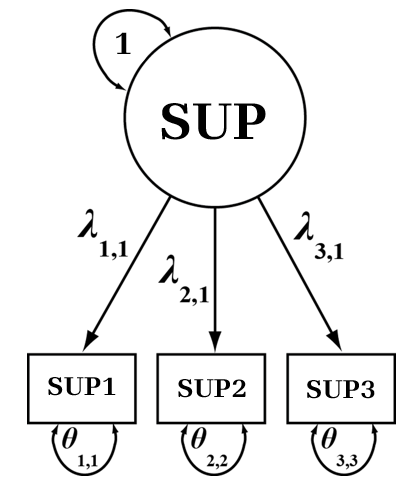
]

---

```{r, echo=FALSE}

data <- data.frame(
  Parameter = c("SUP BY", "SUP1", "SUP2", "SUP3", 
                "Intercepts", "SUP1", "SUP2", "SUP3", 
                "Variances", "SUP", 
                "Resid Var", "SUP1", "SUP2", "SUP3"),
  Estimate = c(NA, 2.202, 2.226, 1.966, 
               NA, 3.287, 2.990, 3.322, 
               NA, 1.000, 
               NA, 0.812, 0.543, 1.768),
  SE = c(NA, 0.155, 0.150, 0.164, 
         NA, 0.199, 0.196, 0.198, 
         NA, 0.000, 
         NA, 0.183, 0.171, 0.243),
  Est_SE = c(NA, 14.246, 14.879, 11.990, 
             NA, 16.522, 15.239, 16.739, 
             NA, 999.000, 
             NA, 4.429, 3.176, 7.265),
  P_Value = c(NA, 0.000, 0.000, 0.000, 
              NA, 0.000, 0.000, 0.000, 
              NA, 999.000, 
              NA, 0.000, 0.001, 0.000)
)

# Round all numeric columns to 3 decimal places and replace NA with empty string
data[2:5] <- lapply(data[2:5], function(x) ifelse(is.na(x), "", format(round(x, 3), nsmall = 3)))

colnames(data) <- c("", "Estimate", "S.E.", "Est./S.E.", "P-Value")

t4 <- kable(data, format = "html", align = "l") %>%
  kable_styling(position = "center", font_size = 16)

```

class: middle, left

## <center><span style="font-size: 80%;">1.1-cfa-fixed-factor.out</span></center>


---

class: middle, left

.pull-left[
<span style="font-size: 80%;">`r t4`</span>
]

.pull-right[
<center><span style="font-size: 90%;">**Unstandardized**</span></center>
<br>
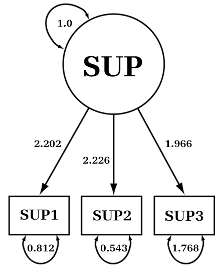
]

---


```{r, echo=FALSE}

data <- data.frame(
  Parameter = c("SUP BY", "SUP1", "SUP2", "SUP3", 
                "Intercepts", "SUP1", "SUP2", "SUP3", 
                "Variances", "SUP", 
                "Resid Var", "SUP1", "SUP2", "SUP3"),
  Estimate = c(NA, 0.925, 0.949, 0.828, 
               NA, 1.382, 1.275, 1.400, 
               NA, 1.000, 
               NA, 0.143, 0.099, 0.314),
  SE = c(NA, 0.019, 0.017, 0.029, 
         NA, 0.117, 0.113, 0.118, 
         NA, 0.000, 
         NA, 0.035, 0.033, 0.049),
  Est_SE = c(NA, 48.366, 54.928, 28.129, 
             NA, 11.818, 11.318, 11.897, 
             NA, 999.000, 
             NA, 4.050, 3.011, 6.435),
  P_Value = c(NA, 0.000, 0.000, 0.000, 
              NA, 0.000, 0.000, 0.000, 
              NA, 999.000, 
              NA, 0.000, 0.003, 0.000)
)

# Round all numeric columns to 3 decimal places and replace NA with empty string
data[2:5] <- lapply(data[2:5], function(x) ifelse(is.na(x), "", format(round(x, 3), nsmall = 3)))

colnames(data) <- c("", "Estimate", "S.E.", "Est./S.E.", "P-Value")

t5 <- kable(data, format = "html", align = "l") %>%
  kable_styling(position = "center", font_size = 16)

```

class: middle, left

.pull-left[
<span style="font-size: 80%;">`r t5`</span>
]

.pull-right[
<center><span style="font-size: 90%;">**STDYX Standardization**</span></center>
<br>
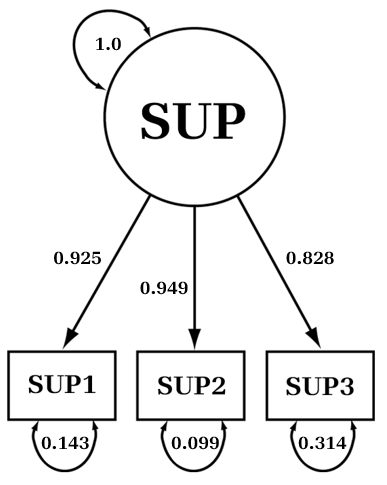
]

<span style="font-size: 60%;">Perceived Social Support (latent SUP) accounts for **85.6%**</span><span style="font-size: 50%;"> $(0.925^2 = 0.856)$ </span><span style="font-size: 60%;">of the variance in the indicator SUP1. Also, 0.856 + 0.143 = 1.00</span>

---

name: r
class: middle, left

## <center><span style="font-size: 70%;">cfa-examples.R (Lavaan)</span></center>

.pull-left[
<span style="font-size: 80%;"><span style="color:#0004FF;">library</span>(lavaan)<br>
m1 &larr; '<br> 
SUP =~ NA\*SUP1 + SUP2 + SUP3<br>
SUP ~~ 1*SUP<br>'
<br>
fit1 &larr; cfa(m1, data=mydata, <br>
std.lv=<span style="color:#0004FF;">T</span>)<br>
summary(fit1, standardized=<span style="color:#0004FF;">T</span>,<br> 
fit.measures=<span style="color:#0004FF;">T</span>, rsquare=<span style="color:#0004FF;">T</span>)</span>
]

.pull-right[

]

---

class: center, middle

## <center><span style="font-size: 70%;">Sample CFA Lavaan Estimates</span></center>

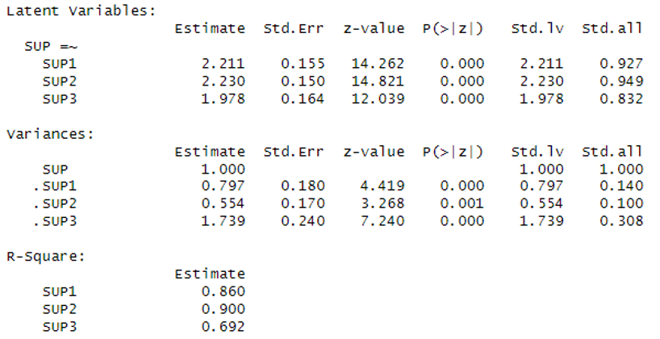

---

name: sas
class: middle, left

## <center><span style="font-size: 80%;">1.1-CFA-Fixed-Factor.sas (Proc Calis)</span></center>

.pull-left[
<br><br>
<span style="font-size: 70%;"><span style="color:#0004FF;">proc calis</span> <span style="color:#0004FF;">data</span>=mydata method=ml;<br>
  <span style="color:#0004FF;">path</span> SUP &rarr; SUP1 SUP2 SUP3 = ly1 - ly3;<br> 
  <span style="color:#0004FF;">pvar</span> SUP = 1,<br>
       SUP1 SUP2 SUP3 = te1 - te3;<br>
<span style="color:#0004FF;">run;</span>
</span>

]

.pull-right[

]

---

class: center, middle

<center><span style="font-size: 80%;">**Sample CFA Proc Calis Estimates**</span></center>
.pull-left[
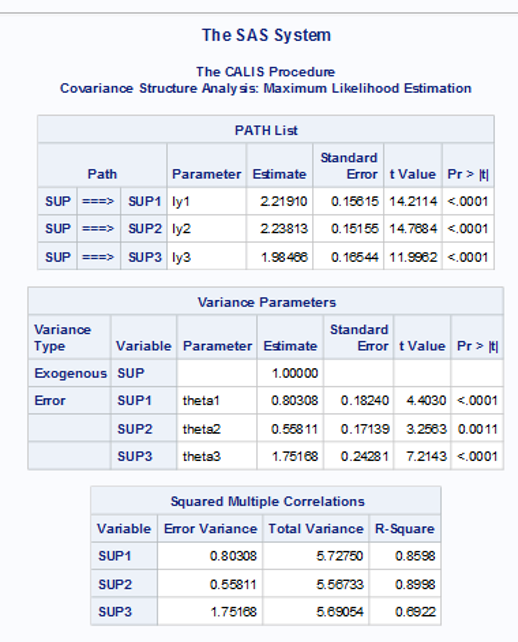
]
.pull-right[
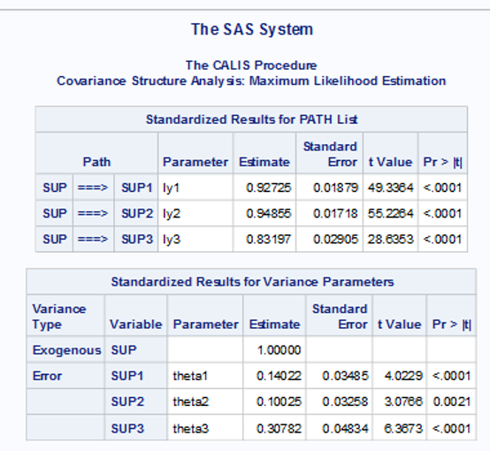
]

---

class: center, middle

## <center><span style="font-size: 80%;">Observed vs. Latent Correlations.</span> `r emo::ji("thinking")` </center>


---

class: middle, center
.small[**2.1-manifest-correlations.inp**]<br>
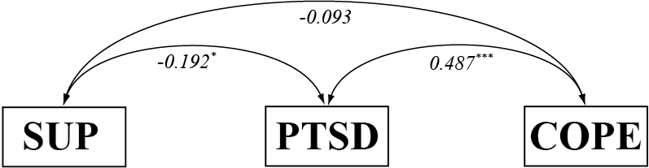<br><br>
.small[**2.2-latent-correlations.inp**]<br>
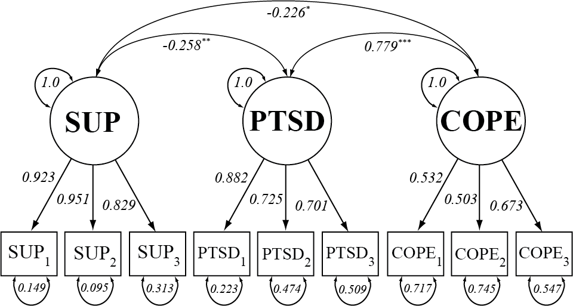

---

class: center, middle

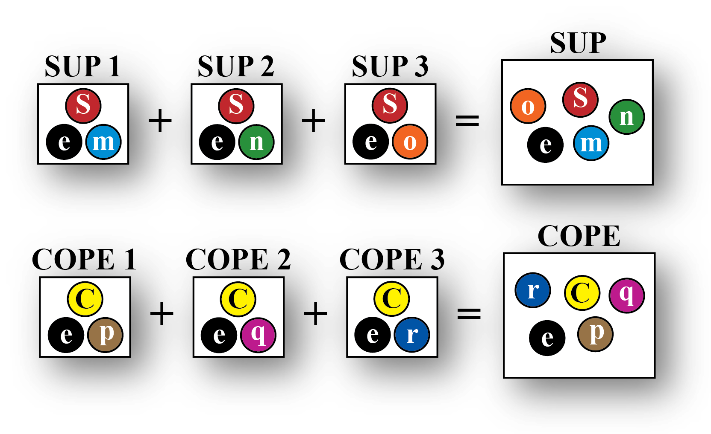
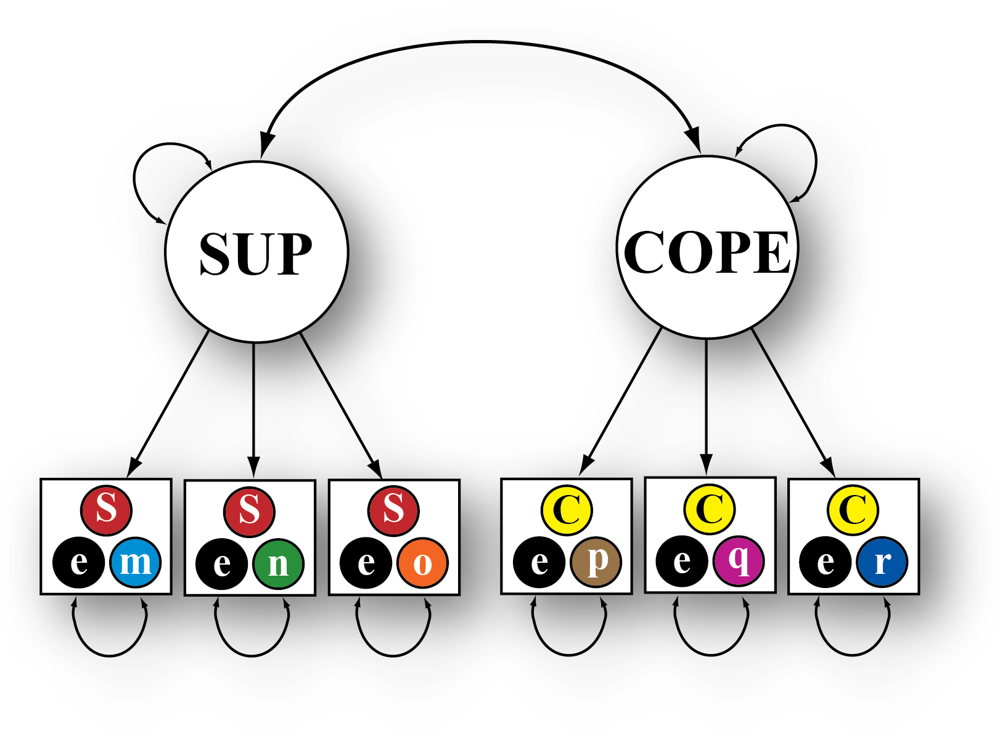
 
---

class: center, middle

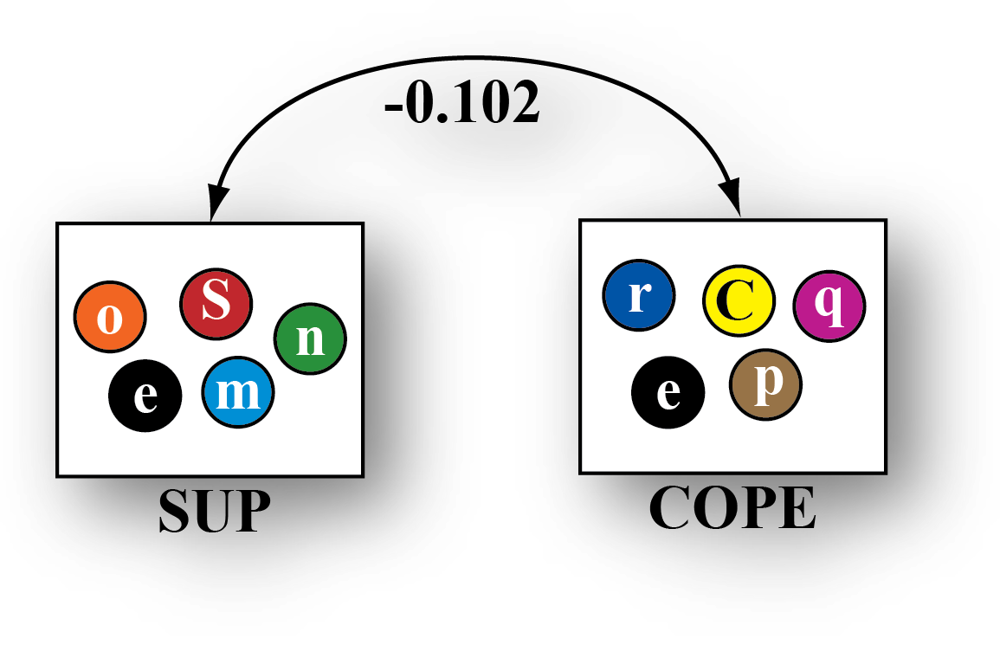
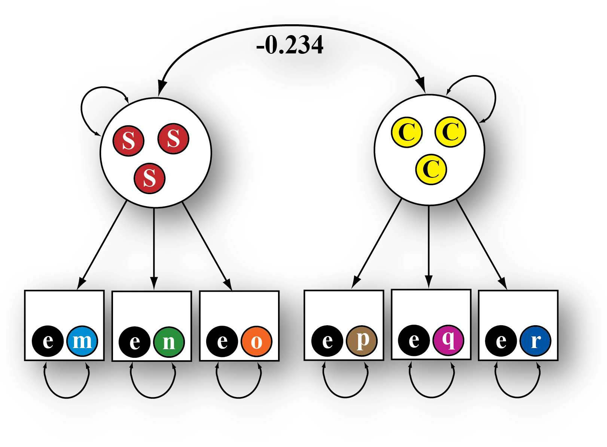
## <center><span style="font-size: 40%;">Disattenuated correlation (controlling for measurement error and specific variance)</span></center>

---

class: middle, center
## <center><span style="font-size: 80%;">Structural Equation Modeling</span> `r emo::ji("raised_eyebrow")` </center>
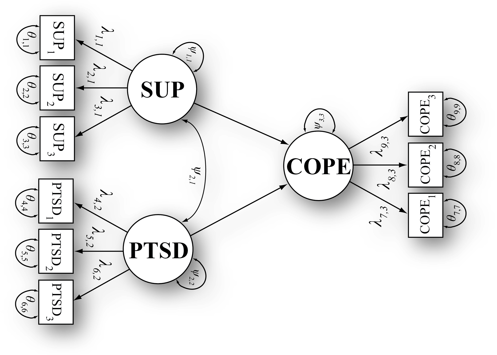

---

class: center, middle

## <center><span style="font-size: 80%;">Latent vs. Manifest/Observed</span></center>

.pull-left[
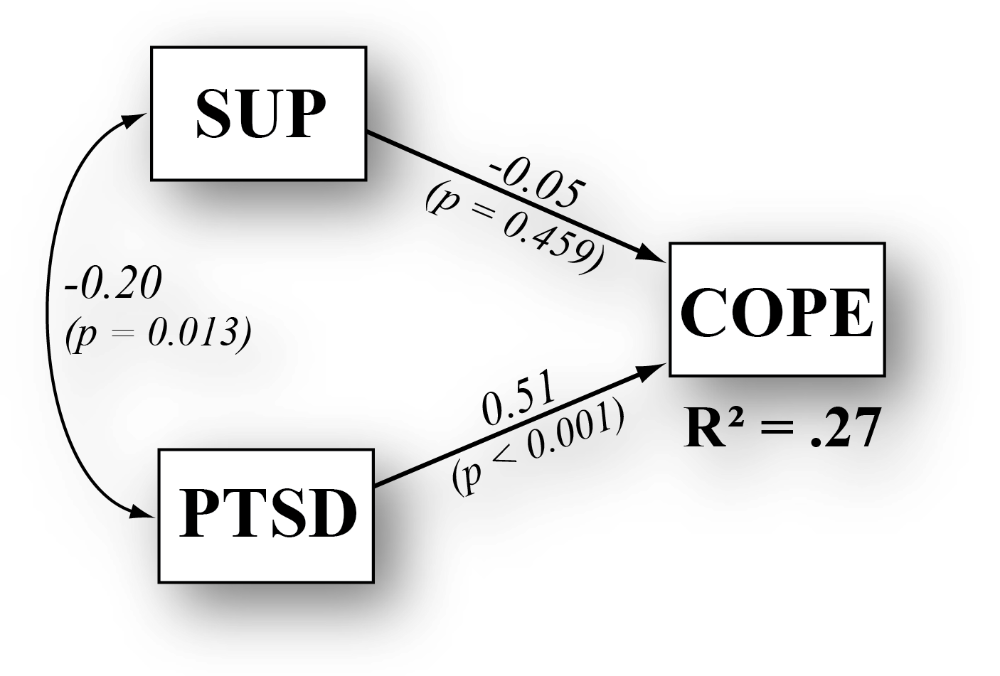
]

.pull-right[
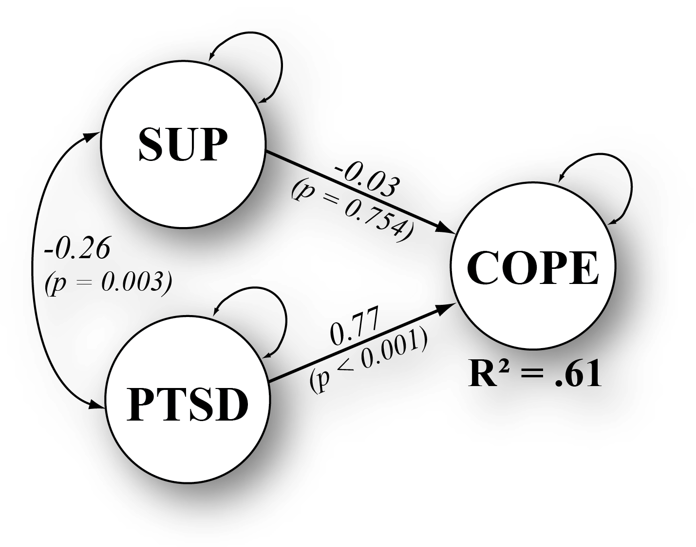
]

<span style="font-size: 60%;">**Measurement error in the observed variables can reduce the accuracy of the regression model.**</span><br>
<span style="font-size: 60%;"> Model Fit: $\chi^2$(24, *n* = 144) = 36.14; RMSEA = .059 (.000; .097) ; CFI = .980; TLI = .970</span>
<br>

---

class: center, middle

.pull-left[
<small> **Manifest $(R^2 = 0.11)$ ** </small> <br>

]

.pull-right[
<small> **Latent $(R^2 = 0.46)$ ** </small> <br>

]

.small[**PTSD severity is a** .highlight[<span style="color: white;">relatively modest</span>] **/** .highlight[<span style="color: white;">key determinant</span>] **in whether coping strategies help or hinder social support.**]


---

class: center, middle

.pull-left[
<small> **Manifest $ab$ = .highlight[<span style="color: white;">-0.10 [-0.37, 0.18]</span>] ** </small> <br>
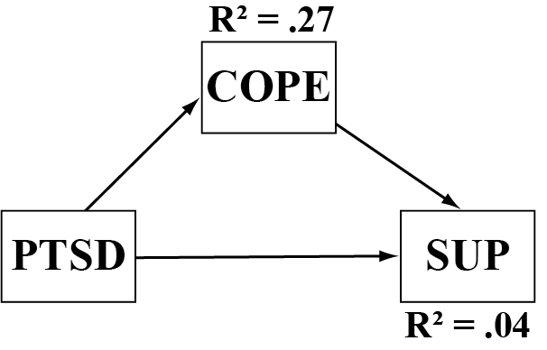
]

.pull-right[
<small> **Latent $ab$ = .highlight[<span style="color: white;">-0.05 [-0.64, 0.54]</span>] ** </small> <br>
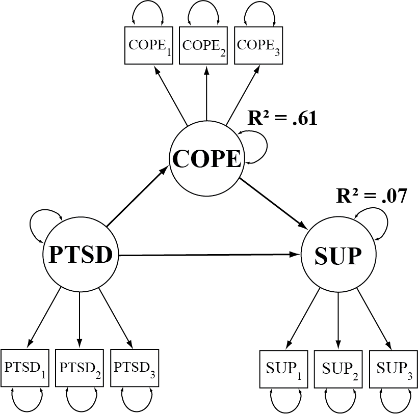
]

.small[**While this might seem less desirable, SEM accounts for measurement error, which can lead to more realistic estimates.**]

---

name: power
class: middle, center

## <center><span style="font-size: 60%;">Power Analysis: Model Parameters</span></center>

.pull-left[

]

.pull-right[

]

<span style="font-size: 70%;"> **80% power for a correlation of at least -0.30 given *N* = 150.** </span>

---

name: 
class: middle, center

## <center><span style="font-size: 60%;">Power Analysis: Model Fit</span></center>

.pull-left[

]

.pull-right[
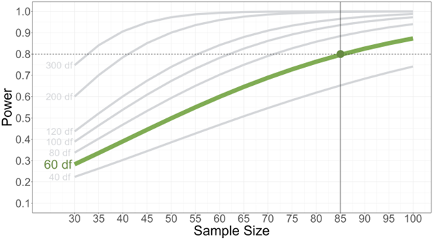
]

<span style="font-size: 70%;"> **80% power for a CFA with at least 60 df given *N* = 85.** </span>

---

name: 
class: middle, center

## <center><span style="font-size: 60%;">End</span></center>
